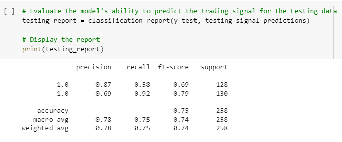
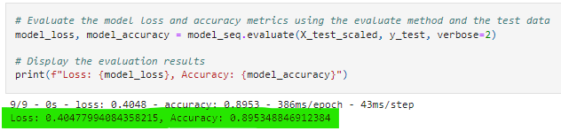

# Transfer Learning in Asset Prediction

## Table of Contents

1. [Project Links](#Project-Links)
1. [Project Summary](#Project-Summary)
1. [Questions](#Questions)
1. [Instructions](#Instructions)
1. [Project Team](#Project-Team)
1. [Contribution Guidelines](#Contribution-Guidelines)
1. [Contanct](#Contact)
1. [License](#License)

## Project Links

[Repo Link](https://github.com/dannynday/goup2) <br>

## Project Summary
The objective of our project was to test the functionality of transfer learning to create a neural network machine learning model that could be applied to a variety of assets. To test this, we built a model that predicted winning positions on oil stocks, specifically ProShares Ultra Bloomberg Crude Oil (UCO). This model was trained on 43 features, including a variety of techinical indicators. We then saved the model and applied it to the crypto-currency markets, specifically looking some of the world's top exchanges and their native tokens (e.g. FTX/FTT, Binance/BNB, etc.)

## Questions

### What is a trading strategy that in theory should work under any market conditions?
UCO and SCO are two stocks based on the oil market (UCO is ultra long and SCO is ultra short), and they have a near perfect inverse realationship. By using technical indicators like simple moving averages (SMA), we should be able to build a machine learning model that predicts when it is worth taking a long position on either one of these stocks.

### What are the challenges of created a well trained Neural Network for predicting winning positions on UCO? And what are the parameters that are ultimately useful for an effective oil model?
One of the challenges was acquiring sufficient data points. Our initial SVC model only required SVM long and SVM short to predict entry and exit points for UCO stock. To solve this we used the FinTa library to add features to the model. The second challenge wa th model itself. Because Neural Networks use layers, we determeind the number of layers and the output. But our intial model was giving us a negative loss and accuracy. To improve the model we change the y-target form -1/1 to 0/1 in order to be more compatible with the output layer's sigmoid activation function. Additionally we found that setting the loss parameter to 'binary_crossentropy' and optimizer to 'adam' provided the best model.

### How does the baseline model created for UCO using sklearn svm compare to the Neural Network model created using deep learing?
Our initial svc model was fairly accurate


Our neural network model improved on the score


### Howe effective is it to apply transfer learning to asset position prediction?
The evidence from our transfer learning test indicated that applying a model built for oil stocks to cryptocurrencies and tokens resulted in an inaccuerate model. 

## Code and Dependencies
This code is to be run on Google Colab. To run, download notebooks and import into Google Colab.
Be sure to download the resources files, ensure the names match the code, and upload as directed in the comments.
`Python 3`

The following Python Libraries were also imported and used

`import pandas as pd`

`import numpy as np`

`import datetime as dt`

`import yfinance as yf`

`from sklearn import svm`

`from sklearn.metrics import classification_report`

`from keras.models import Sequential,  Model`

`from keras.layers import Dense, Activation, Dropout`

`from tensorflow.keras.models import model_from_json`

`from sklearn.preprocessing import StandardScaler`

`from sklearn.model_selection import train_test_split`


## Instructions
This code is to be run on Google Colab. Supporting files in the Resources folder will need to be uploaded with
`from google.colab import files`

`uploaded = files.upload()`


## Project Team

[Ben Eilers](https://github.com/bweilers) <br>
[Wade Burgess](https://github.com/WadeB22) <br>
[Danny Ndayisenga](https://github.com/dannynday) <br>

## Contribution Guidelines:

```
Feel free to contribute to this repo by creating issues or sending an email to any of the contributors in the list below.
```

## Contact

<details>
    <summary>Contact</summary>
    ben.eilers@gmail.com <br>
    @gmail.com <br>
    @yahoo.com <br>

</details>

